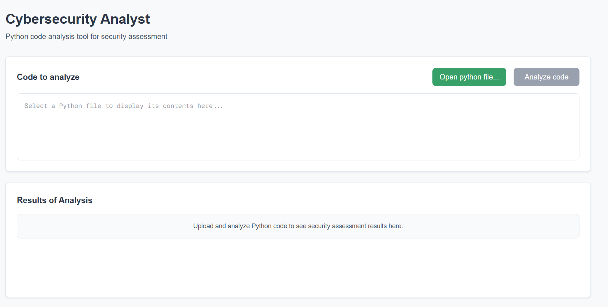
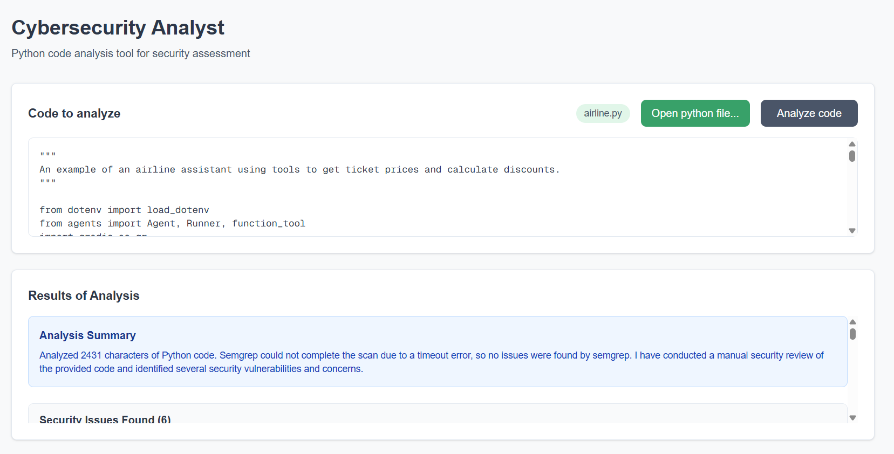
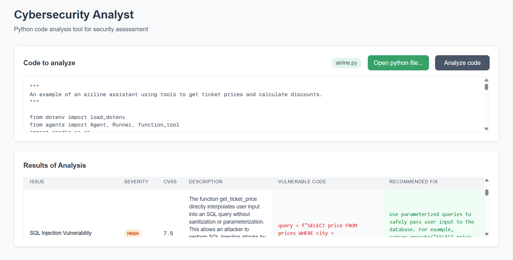
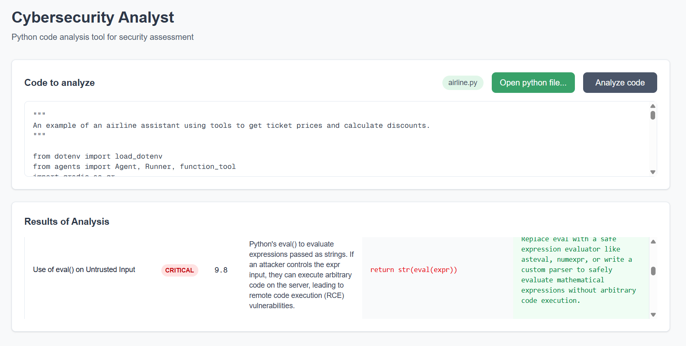
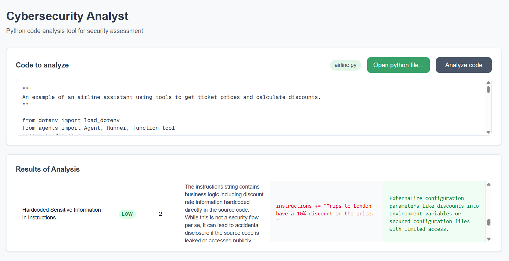
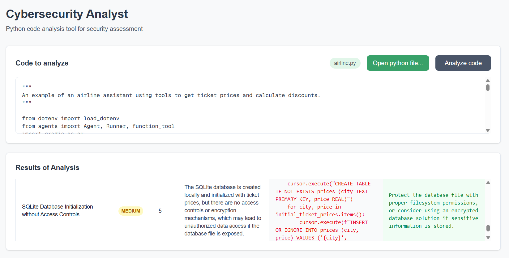

<div align="center">
  <strong></strong>

  # Cybersecurity Analyzer

  _By **BINATI AInalytics**_
</div>

An AI-powered web application for analyzing Python code for security vulnerabilities using OpenAI Agents SDK and Semgrep. Built as part of the "AI in Production" course to teach modern cloud deployment practices.

## Overview

Cybersecurity Analyzer combines the power of AI and static analysis to identify security vulnerabilities in Python code. It uses OpenAI's advanced language models with the Semgrep Model Context Protocol (MCP) server to provide comprehensive security analysis.

**Educational Purpose**: This project serves as a hands-on learning tool for deploying containerized applications to Azure Container Apps and Google Cloud Run using modern DevOps practices.

## Screenshots

<details>
<summary>Click to view application screenshots</summary>








</details>

## Features

- **AI-Powered Analysis**: Uses OpenAI's language models to understand and explain security vulnerabilities
- **Static Code Analysis**: Integrates Semgrep for comprehensive security scanning
- **Interactive Web Interface**: Clean, modern UI built with Next.js and Tailwind CSS
- **Real-time Results**: Get instant feedback on code security issues
- **Cloud-Ready**: Optimized for deployment on Azure Container Apps and Google Cloud Run

## Architecture

### Frontend
- **Framework**: Next.js with TypeScript
- **Styling**: Tailwind CSS
- **Build**: Static export for production
- **Port**: 3000 (development)

### Backend
- **Framework**: FastAPI with Python 3.12
- **AI Integration**: OpenAI Agents SDK
- **Security Tool**: Semgrep MCP Server
- **Port**: 8000

### Deployment
- Single Docker container serves both frontend (static files) and backend API
- Frontend built as static export and served by FastAPI
- Port 8000 for all traffic in production

## Prerequisites

- **Python**: 3.12 or higher
- **Node.js**: 18 or higher
- **uv**: Python package manager ([installation guide](https://docs.astral.sh/uv/))
- **Docker**: For containerized deployment
- **Terraform**: For infrastructure as code (optional)

### API Keys Required
- **OpenAI API Key**: Get from [OpenAI Platform](https://platform.openai.com/)
- **Semgrep App Token**: Get from [Semgrep](https://semgrep.dev/)

## Local Development

### 1. Clone the Repository
```bash
git clone https://github.com/CyprianFusi/cyber-analyzer.git
cd cyber-analyzer
```

### 2. Set Up Environment Variables
Create a `.env` file in the project root:
```env
OPENAI_API_KEY=your_openai_api_key_here
SEMGREP_APP_TOKEN=your_semgrep_token_here
```

### 3. Run Backend
```bash
cd backend
uv run server.py
```
Backend will start on http://localhost:8000

### 4. Run Frontend (in a new terminal)
```bash
cd frontend
npm install
npm run dev
```
Frontend will start on http://localhost:3000

## Docker Deployment

### Build the Image
```bash
docker build -t cyber-analyzer .
```

### Run the Container
```bash
docker run --rm -d \
  --name cyber-analyzer \
  -p 8000:8000 \
  --env-file .env \
  cyber-analyzer
```

### Access the Application
Open your browser to http://localhost:8000

### View Logs
```bash
docker logs cyber-analyzer
```

### Stop the Container
```bash
docker stop cyber-analyzer
```

## Cloud Deployment

### Azure Container Apps

Deploy to Azure using Terraform:

```bash
cd terraform/azure
terraform init
terraform apply
```

The application will be deployed with:
- 2.0 GiB memory allocation (required for Semgrep)
- 1.0 CPU cores
- Auto-scaling to zero when idle
- Secrets managed via Azure Key Vault

### Google Cloud Run

Deploy to GCP using Terraform:

```bash
cd terraform/gcp
terraform init
terraform apply
```

Configuration includes:
- Container memory: 2Gi
- Container CPU: 1
- Max instances: 10
- Artifact Registry for container storage

## Environment Variables

| Variable | Description | Required |
|----------|-------------|----------|
| `OPENAI_API_KEY` | OpenAI API key for AI analysis | Yes |
| `SEMGREP_APP_TOKEN` | Semgrep authentication token | Yes |

## Technology Stack

### Frontend
- Next.js 15
- React 19
- TypeScript
- Tailwind CSS
- Axios for API calls

### Backend
- FastAPI
- OpenAI Agents SDK
- Semgrep MCP Server
- Python 3.12
- uvicorn

### DevOps
- Docker
- Terraform
- Azure Container Apps
- Google Cloud Run
- Azure Container Registry
- GCP Artifact Registry

## Important Notes

### MCP Version Compatibility
This project pins MCP to version 1.12.2 due to a breaking change in 1.12.3:
- semgrep-mcp v0.4.1 uses the `version` parameter in FastMCP constructor
- MCP 1.12.3 removed this parameter, causing a TypeError
- The project will be updated once semgrep-mcp is compatible with newer MCP versions

### Memory Requirements
Semgrep's rule registry loading requires at least 2GB of RAM in cloud environments. The Terraform configurations set memory to 2.0Gi to prevent SIGKILL errors.

### Cross-Platform Docker Builds
When building on Apple Silicon (M1/M2), the Dockerfile targets AMD64 architecture for cloud compatibility.

## Known Issues

1. **MCP Version Lock**: Currently locked to MCP 1.12.2 (see above)
2. **Cloud Memory**: Requires 2GB RAM minimum for Semgrep to function properly
3. **CORS Configuration**: Wildcard origins allowed when frontend is served from same domain

## Development Commands

### Frontend
```bash
npm run dev          # Start development server
npm run build        # Build for production
npm run lint         # Run ESLint
npm run typecheck    # Run TypeScript type checking
```

### Backend
```bash
uv run server.py     # Start FastAPI server
```

## Project Structure

```
cyber/
├── backend/              # FastAPI backend
│   ├── server.py        # Main server file
│   └── pyproject.toml   # Python dependencies
├── frontend/            # Next.js frontend
│   ├── src/
│   │   └── app/         # Next.js app directory
│   ├── package.json     # Node dependencies
│   └── next.config.ts   # Next.js configuration
├── terraform/           # Infrastructure as code
│   ├── azure/          # Azure deployment
│   └── gcp/            # GCP deployment
├── assets/             # Project images and logos
├── Dockerfile          # Single-stage Docker build
├── .env               # Environment variables (not in git)
└── README.md          # This file
```

## Contributing

This is an educational project for the "AI in Production" course. Students are encouraged to:
- Experiment with different deployment configurations
- Optimize Docker builds
- Enhance the frontend UI
- Add additional security analysis features

## License

This project is created for educational purposes as part of Ed Donner's "AI in Production" course.

## Support

For questions about the course or deployment issues, please refer to the course materials or contact your instructor.

---

Built with ❤️ for learning cloud deployment and AI integration
